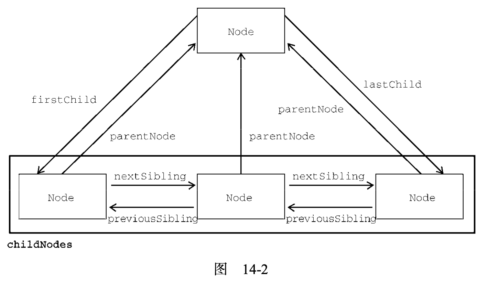

文档对象模型（DOM）是 HTML 和 XML 的文档的编程接口。DOM 表示由多层节点构成的文档，通过它可以添加、删除和修改网页的各个部分。

节点：分很多类型，每种类型对应着文档中不同的信息和标记，也都有自己不同的特性、数据和方法。

关系：构成了层级，让标记可以表示为树形结构。

`document` 节点：表示每个文档的根节点，根节点的唯一子节点是 `<html>` 元素，我们称之为文档元素，每个文档只能有一个文档元素，在 HTML 页面中，文档元素始终是 `<html>` 元素。

## Node 类型

DOM1 描述了名为 Node 的接口，这个接口是所有 DOM 节点类型都必须实现的。DOM 中总共有 12 种节点类型，这些类型都继承自一种基本类型（在 JS 中，所有节点类型都继承 Node 类型）。

每个节点都有 nodeType 属性，表示该节点的类型。节点类型由定义在 Node 类型上的 12 个数值常量表示：

- Node.ELEMENT_NODE(1)
- Node.ATTRIBUTE_NODE(2)
- Node.TEXT_NODE(3)
- Node.CDATA_SECTION_NODE(4)
- Node.ENTITY_REFERENCE_NODE(5)
- Node.ENTITY_NODE(6)
- Node.PROCESSING_INSTRUCTION_NODE(7)
- Node.COMMENT_NODE(8)
- Node.DOCUMENT_NODE(9)
- Node.DOCUMENT_TYPE_NODE(10)
- Node.DOCUMENT_FRAGMENT_NODE(11)
- Node.NOTATION_NODE(12)

浏览器并不支持所有节点类型，最常用的是元素节点和文本节点。

`nodeName` 和 `nodeValue` 保存着有关节点的信息，这两个属性的值完全取决于节点类型。对元素节点而言，`nodeName` 始终等于元素的标签名，而 `nodeValue` 则始终指向 `null`。

每个节点都有一个 `childNodes` 属性，其中包含一个 `NodeList` 的实例。`NodeList` 是一个类数组对象，用于存储可以按位置存取的有序节点，`NodeList` 是实时的活动对象，而不是第一次访问时所获取的内容快照。这个列表中第一个节点的 `previousSibling` 属性是 `null`，最后一个节点的 `nextSibling` 属性也是 `null`。如果 `childNodes` 中只有一个节点，则它的 `previousSibling` 和 `nextSibling` 属性都是 `null`。

每个节点都有一个 `parentNode` 属性，指向其 `DOM` 树中的父元素。父节点和它的第一个及最后一个子节点也有专门属性: `firstChild` 和 `lastChild` 分别指向 `childNodes` 中的第一个和最后一个子节点。



`childNodes` 利用这些关系指针，几乎可以访问到文档树中的任何节点。还有一个便利的方法是 `hasChildNodes()`，这个方法如果返回 `true` 则说明节点有一个或多个子节点。

### appendChild()、insertBefore()、replaceChild() 和 removeChild()

appendChild() 是最常用的方法，用于在 `childNodes` 列表末尾添加节点，appendChild()方法返回新添加的节点，**如果把文档中已经存在的节点传给 appendChild()，则这个节点会从之前的位置被转移到新位置**

```js
// 假设 someNode 有多个子节点
let returnedNode = someNode.appendChild(someNode.firstChild); 
alert(returnedNode == someNode.firstChild); // false 
alert(returnedNode == someNode.lastChild); // true
```

如果想把节点放到 `childNodes` 中的特定位置而不是末尾，则可以使用 insertBefore()方法。 这个方法接收两个参数: 要插入的节点 和 参照节点。调用这个方法后，要插入的节点会变成参照节点的前一个同胞节点，并被返回。如果参照节点是 `null`，则 insertBefore()与 appendChild()效果相同。

appendChild() 和 insertBefore() 在插入节点时不会删除任何已有节点。

replaceChild() 方法接收两个参数: 要插入的节点 和 要替换的节点。要替换的节点会被返回并从文档树中完全移除，要插入的节点会取而代之。

```js
// 替换第一个子节点
let returnedNode = someNode.replaceChild(newNode, someNode.firstChild); 
// 替换最后一个子节点
returnedNode = someNode.replaceChild(newNode, someNode.lastChild);
```

removeChild()方法用于删除一个节点，这个方法接收一个参数，即要移除的节点，被移除的节点会被返回。

```js
// 删除第一个子节点
let formerFirstChild = someNode.removeChild(someNode.firstChild);
// 删除最后一个子节点
let formerLastChild = someNode.removeChild(someNode.lastChild);
```

### cloneNode()

所有节点类型还共享 cloneNode() 方法。cloneNode() 会返回与调用它的节点一模一样的节点。cloneNode() 方法接收一个 **布尔值参数**，表示是否深复制。在传入 `true` 参数时，会进行深复制，即复制节点及其整个 `子DOM` 树。如果传入 `false`，则只会复制调用该方法的节点。

复制返回的节点属于文档所有，但尚未指定父节点，所以可称为 **孤儿节点**(orphan)。可以通过 appendChild()、 insertBefore()或 replaceChild() 方法把孤儿节点添加到文档中。

PS: cloneNode() 方法不会复制添加到 `DOM` 节点的 `JavaScript` 属性，比如事件处理程序。这个方法只复制 `HTML` 属性，以及可选地复制子节点。

